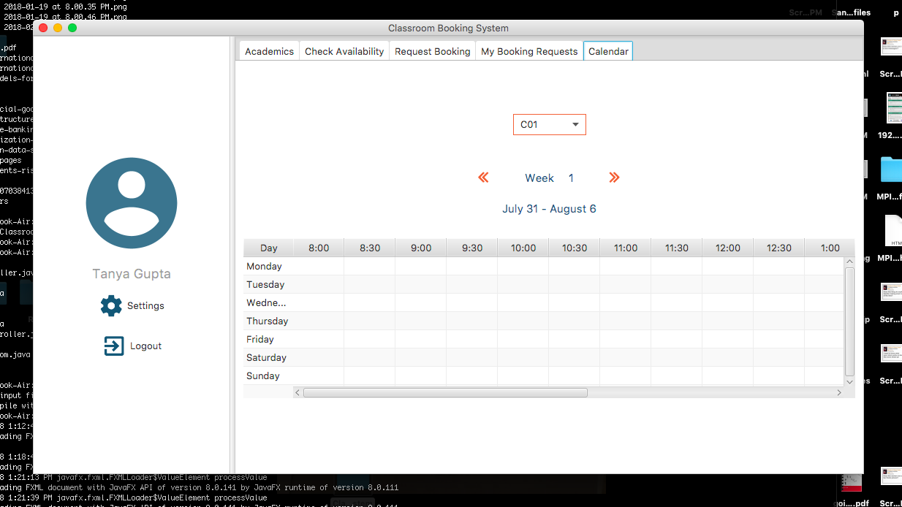

# ClassroomBookingSystem
As part of Advanced Programming course, developed a desktop based Java application in a group to manage classroom bookings at IIIT-D for administration, faculty, and students. Apart from booking the rooms, students can also use this application to choose courses based on the post-conditions hints specified by them.

## Building & Running
Once in the Classroom Booking System directory, compile the program using the following and then run the application:
```
javac *.java
java Login
```
## Screenshots




## Problems Faced
* The serialized objects, once stored in the files, the changes made elsewhere weren’t reflected when the file was read. We had to change our approach to handle this issue.
* Having made a menu driven program first, we faced many issues while integrating the GUI with the backend. Filling TableView and ListView required ObservableLists which  changed the base classes a lot. We often found ourselves switching between ListView and TableView for displaying data.
* Displaying TimeTable and the Calendar view was particularly troublesome. We had expected that there would have been some functionality to add data directly to cells. On searching, we found that data had to be filled Column-wise. 

## Additional Features
* The View Calendar functionality which provides the schedule for a room for each week of the semester.
* This is useful when a User(Faculty/Admin/Student) checks for the availability of a room but finds that it’s unavailable.
* In such a situation, rather than randomly checking for different time/day/room he/she can easily open up the schedule of a room and book it accordingly. 
